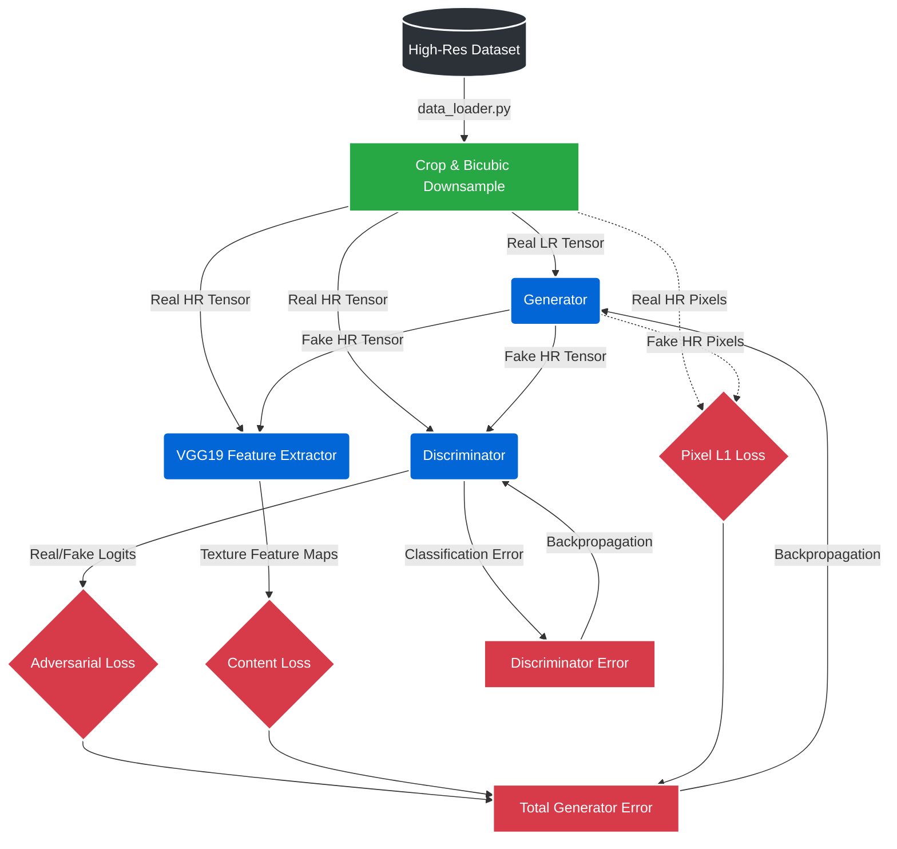

# 🔍 SRGAN-TF: High-Fidelity Image Super-Resolution

[](https://www.tensorflow.org/)
[](https://www.python.org/)

An industry-grade, TensorFlow-based implementation of Super-Resolution Generative Adversarial Networks (SRGAN). This framework upscales low-resolution images by 4x, utilizing a composite loss function (Pixel, Perceptual/VGG, and Adversarial) to hallucinate high-frequency photorealistic textures.

## 🏗️ System Architecture

The pipeline follows a multi-critic adversarial training workflow, ensuring that the generated images are not just mathematically accurate, but perceptually sharp.



## 📂 Repository Anatomy

```text
├── src/                    # Core source code
│   ├── data_loader.py      # TF data pipeline and augmentation
│   ├── generator.py        # SRResNet / EDSR architecture
│   ├── discriminator.py    # PatchGAN classifier
│   ├── vgg_features.py     # Perceptual feature extraction
│   ├── losses.py           # Composite loss functions
│   ├── train.py            # Main training loop and orchestrator
│   ├── train_quick.py      # Rapid prototyping and debugging loop
│   ├── inference.py        # Single-image production processing
│   ├── evaluate.py         # PSNR and SSIM quantitative metrics
│   ├── visualize_grid.py   # Qualitative side-by-side assessment
│   └── utils.py            # Tensor conversions and file handling
└── README.md
```

## 🚀 Key Features
* **Efficient Data Loading:** Utilizes `tf.data.Dataset` with parallel prefetching to eliminate I/O bottlenecks.
* **Sub-Pixel Convolutions:** Employs `tf.nn.depth_to_space` (PixelShuffle) to avoid checkerboard artifacts during upscaling.
* **Stable Adversarial Training:** Implements label smoothing (0.9) to prevent premature discriminator convergence.

## 🛠️ Quick Start

**1. Train the Model**
Ensure your high-resolution images are mapped in the data loader.
```bash
python src/train.py
```

**2. Evaluate Metrics**
Calculate PSNR and SSIM scores against a validation set.
```bash
python src/evaluate.py
```

**3. Run Inference**
Upscale a custom image using pre-trained weights.
```bash
python src/inference.py --input blurry_image.jpg --output enhanced_image.jpg
```
