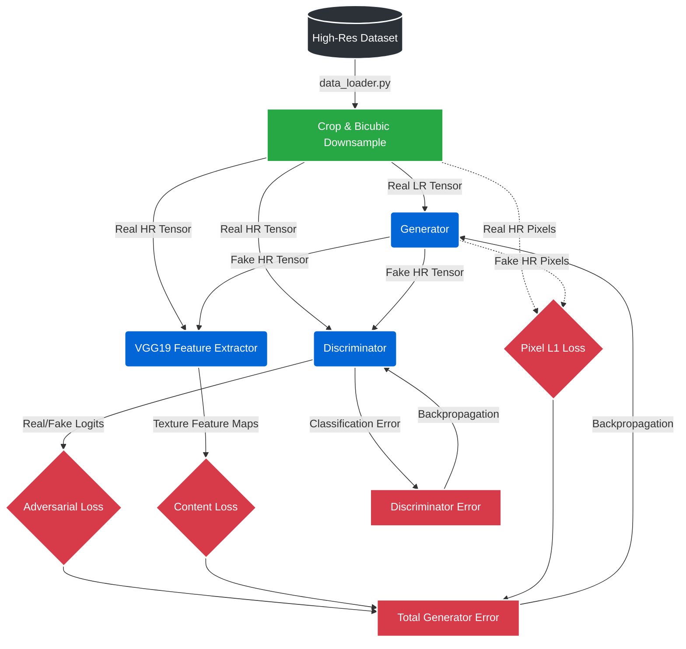

# 🔍 SRGAN-TF: High-Fidelity Image Super-Resolution

[](https://www.tensorflow.org/)
[](https://www.python.org/)

An industry-grade, TensorFlow-based implementation of Super-Resolution Generative Adversarial Networks (SRGAN). This framework upscales low-resolution images by 4x, utilizing a composite loss function (Pixel, Perceptual/VGG, and Adversarial) to hallucinate high-frequency photorealistic textures.

## 🏗️ System Architecture

The pipeline follows a multi-critic adversarial training workflow, ensuring that the generated images are not just mathematically accurate, but perceptually sharp.



## 📂 Repository Anatomy

```text
├── src/                    # Core source code
│   ├── data_loader.py      # TF data pipeline and augmentation
│   ├── generator.py        # SRResNet / EDSR architecture
│   ├── discriminator.py    # PatchGAN classifier
│   ├── vgg_features.py     # Perceptual feature extraction
│   ├── losses.py           # Composite loss functions
│   ├── train.py            # Main training loop and orchestrator
│   ├── train_quick.py      # Rapid prototyping and debugging loop
│   ├── inference.py        # Single-image production processing
│   ├── evaluate.py         # PSNR and SSIM quantitative metrics
│   ├── visualize_grid.py   # Qualitative side-by-side assessment
│   └── utils.py            # Tensor conversions and file handling
└── README.md
```

## 🚀 Key Features
* **Efficient Data Loading:** Utilizes `tf.data.Dataset` with parallel prefetching to eliminate I/O bottlenecks.
* **Sub-Pixel Convolutions:** Employs `tf.nn.depth_to_space` (PixelShuffle) to avoid checkerboard artifacts during upscaling.
* **Stable Adversarial Training:** Implements label smoothing (0.9) to prevent premature discriminator convergence.

## 🛠️ Quick Start

**1. Train the Model**
Ensure your high-resolution images are mapped in the data loader.
```bash
python src/train.py
```

**2. Evaluate Metrics**
Calculate PSNR and SSIM scores against a validation set.
```bash
python src/evaluate.py
```

**3. Run Inference**
Upscale a custom image using pre-trained weights.
```bash
python src/inference.py --input blurry_image.jpg --output enhanced_image.jpg
```
1. The Data Engine
data_loader.py

Function: Handles the high-performance data ingestion pipeline using tf.data. It reads High-Resolution (HR) images, randomly crops them, and generates degraded Low-Resolution (LR) pairs using bicubic downsampling.

Usage: Imported automatically by train.py to feed batches to the GPU without I/O bottlenecks.

2. The Neural Architectures
generator.py

Function: The core Super-Resolution network (SRResNet/EDSR). It utilizes deep residual blocks for feature extraction and Sub-Pixel Convolutions (PixelShuffle) to mathematically upscale LR images by 4x without checkerboard artifacts.

Usage: Used during training to generate hallucinated images, and deployed independently in inference.py for production.

discriminator.py

Function: The adversarial critic. A PatchGAN-style convolutional classifier that evaluates high-frequency textures and penalizes the generator for producing blurry or artificial-looking images.

Usage: Used exclusively during the GAN training phase in train.py to calculate the Adversarial Loss.

vgg_features.py

Function: A frozen, pre-trained VGG19 ImageNet model truncated at the block5_conv4 layer. It acts as a perceptual feature extractor.

Usage: Used during training to compare the deep structural and textural differences (Content Loss) between the generated image and the ground truth.

3. Training & Optimization
losses.py

Function: The mathematical grading system. It houses the custom definitions for Pixel Loss (L1), Content Loss (VGG MSE), and Adversarial Loss (Binary Cross-Entropy with label smoothing).

Usage: Imported by train.py to calculate the final composite loss and compute gradients for backpropagation.

train.py

Function: The master orchestrator. It initializes the models, sets the dynamic loss weights, manages the tf.GradientTape training loops, and saves model checkpoints.

Usage: Run this from the terminal (python src/train.py) to train the framework from scratch.

4. Evaluation & Production
inference.py

Function: The production-ready deployment script. It loads only the trained Generator weights and processes new images without loading the heavy discriminator or VGG networks.

Usage: Run from the terminal by end-users to enhance their personal images.

evaluate.py

Function: The quantitative testing suite. It runs standard scientific metrics like PSNR (Peak Signal-to-Noise Ratio) and SSIM (Structural Similarity) against a validation dataset.

Usage: Run after training to generate mathematical benchmarks for research papers or technical reports.

visualize_grid.py & utils.py

Function: Helper modules for qualitative assessment. They handle tensor-to-image conversions and stitch LR, Fake-HR, and Real-HR images side-by-side.

Usage: Called automatically during training to save visual progress updates to the results/ folder.
